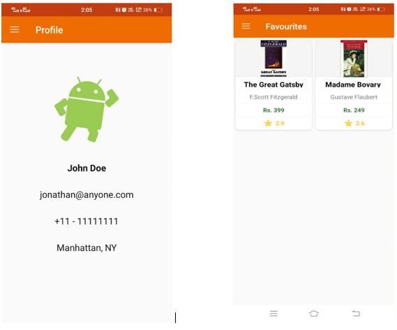
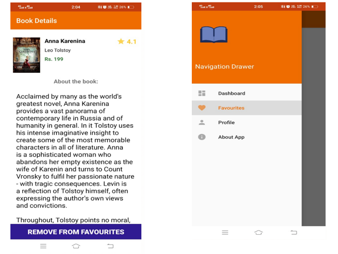
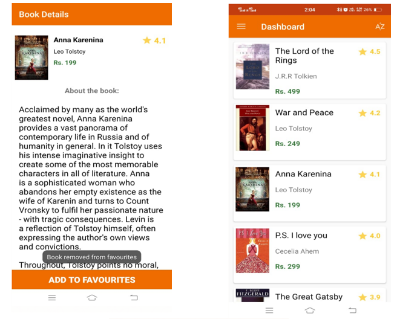
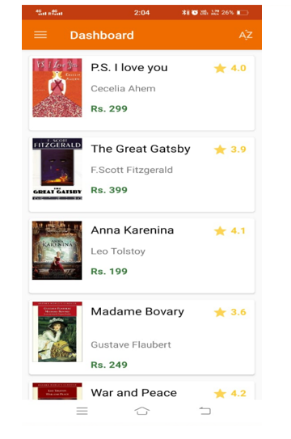

# Bookhub App
# APP DEVELOPMENT PROJECT
•	This is a book management app. It contains features like fetching books from the internet and showing the list with the help of API which is provided by
  the Internshala trainings and showing the details of the selected book and the feature of adding and deleting the book from the 
  favorites list and the feature of sorting the book according to alphabetical order.

•	It is a book app that lists famous books. In this, we can also save some books as our favorites for future reference.

•	I expanded it and added the sorting the books in alphabetical order feature.

•	The UI of this app contains screens the home page is the dashboard whichlistst all the book’s name, author name, price, 
  and the ratings of the book. The next screen is the single screen which contains info of a particular book you reached this screen by clicking on 
  the book name in the dashboard list it contains the author name book name rating and price of the book and about the Book and remove to fav and delete from the favorite button.

•	The next screen is the page that contains all the favorite books.it shows the book’s info in the grid form.

•	It also contains a screen of the about app page which has info about the app.

•	Profile screen contains maker name and contact info.

•	It also contains a navigation var that has menu buttons of going to different screens like a profile about app favorite dashboard.

•	It contains the following pages:
 1. Home page 
 2. The favorites page
 3. Profile page 
 4. FAQ page 
 
 

## All these pages will be fragments and will open from the navigation drawer and some data will be fetched from an external server with the help of API.

